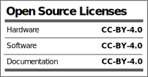

# OpenFLRC_Library

Object-oriented C++ abstraction library for Semtech SX1280 FLRC transception on ESP32-S3.

This library is designed for PlatformIO and provides direct control over the SX1280/E28 RF module, implementing high-speed FLRC transception, DMA-allocated SPI transactions, and hardware interrupts.

## Installation

Add the library dependency to your PlatformIO `platformio.ini` file:

```ini
lib_deps =
    jgromes/RadioLib @ ^7.1.2
```

Then clone this repository into the `lib` folder of your project:
```bash
git clone https://github.com/FrancoArenasM/OpenFLRC_Library.git
```

## Features
- Direct half-duplex transmit/receive control
- Optimized SPI DMA buffer transactions
- Sub-millisecond interrupt-driven state machine
- Hardware Power Amplifier (PA) / Low Noise Amplifier (LNA) host toggling (TX_EN/RX_EN)

## License and Certification

This project is certified as Open Source Hardware by the Open Source Hardware Association (OSHWA).

[](https://certification.oshwa.org/)

### Open Source Licenses Facts

All files, hardware designs, software libraries, and documentation are released under the **Creative Commons Attribution 4.0 International (CC BY 4.0)** license.


